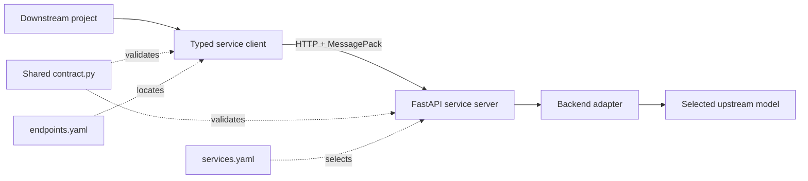

<div align="center">

# robot-tools

**Typed clients and independently deployable runtimes for robotics model services.**

[Quick start](#quick-start) · [Services](#supported-services) · [Configuration](#configuration) · [Architecture](#architecture) · [Troubleshooting](#troubleshooting)

</div>

`robot-tools` turns GPU-heavy vision and manipulation models into small, typed HTTP services. A downstream project installs one lightweight Python SDK, while each GPU machine installs and launches only the model runtimes it actually needs.

## Why robot-tools?

- **Install only what you use.** A normal clone downloads no model upstreams; `install` and `download` operate only on services selected in `services.yaml`.
- **Keep callers lightweight.** NumPy, Pydantic, MessagePack, and HTTP live in the SDK. Torch, CUDA packages, checkpoints, and research code stay inside independent runtimes.
- **Share typed contracts.** Each client and server uses the same Pydantic request and response models.
- **Validate the full connection.** Clients check service identity, wire version, service API version, readiness, and required actions before inference.
- **Test without a GPU.** Every runtime has deterministic fake mode that needs no upstream source, model dependency, or weight file.
- **Deploy services independently.** Each runtime owns its Python version, lockfiles, server, backend, upstream, and lifecycle scripts.

## Supported services

| Service | Client | Public actions | Default port | Runtime guide |
|---|---|---|---:|---|
| Fast FoundationStereo | `FastFSClient` | `reconstruct` | 5556 | [FastFS](runtimes/fastfs/README.md) |
| GraspGen | `GraspGenClient` | `generate_grasps`, `generate_collision_free_grasps` | 5557 | [GraspGen](runtimes/graspgen/README.md) |
| SAM 3 | `SAM3Client` | `segment_by_text`, `segment_by_point` | 5558 | [SAM3](runtimes/sam3/README.md) |
| GraspGenX | `GraspGenXClient` | `get_metadata`, `generate_grasps`, `generate_safe_grasps`, `generate_grasps_for_all`, `generate_safe_grasps_for_all` | 5559 | [GraspGenX](runtimes/graspgenx/README.md) |

The real runtimes have been verified on an RTX 5090. Each runtime's `PREREQUISITES.md` records its tested Python, Torch/CUDA, driver, upstream commit, storage, and acceptance checks.

## Prerequisites

For fake mode and SDK development:

- [uv](https://docs.astral.sh/uv/)
- Git
- Python 3.10 or newer; uv manages service-specific Python versions

Real runtimes may additionally require Git LFS, an NVIDIA GPU and driver, model access credentials, system compilers, and persistent model storage. Read the selected runtime's prerequisites before installing it.

> [!NOTE]
> Fake mode exercises configuration, transport, contracts, compatibility checks, and composed pipelines. It does not validate real model quality, GPU integration, latency, or memory use.

## Quick start

The fastest path is to launch one fake service, verify it, and make a typed client call.

### 1. Clone without model upstreams

```bash
git clone https://github.com/xukristenyan/robot-tools.git
cd robot-tools
```

> [!IMPORTANT]
> Use a normal clone. Do not pass `--recurse-submodules`: selected upstream repositories are initialized later by `robot-tools install`.

### 2. Select a service

Create `services.yaml` on the machine that will run the service:

```yaml
services:
  - name: sam3
    port: 5558
    extra_args: ["--fake"]
```

Create `endpoints.yaml` on the machine or project that will call it:

```yaml
endpoints:
  sam3: { host: 127.0.0.1, port: 5558 }
```

Any combination of registered services is valid. Start from [`services.example.yaml`](services.example.yaml) and [`endpoints.example.yaml`](endpoints.example.yaml) when you need more options.

### 3. Start and verify the fake runtime

```bash
uv run robot-tools list
uv run robot-tools sync
uv run robot-tools launch
```

The lifecycle commands use `./services.yaml` by default. In another terminal, verify the endpoint:

```bash
uv run robot-tools status endpoints.yaml
```

`status` reports success only when the endpoint exposes the expected service identity, wire protocol, API version, and actions.

### 4. Make a typed call

```python
import numpy as np

from robot_tools.core.endpoints import get_endpoint
from robot_tools.services.sam3 import SAM3Client

endpoint = get_endpoint("sam3", "endpoints.yaml")
image = np.zeros((480, 640, 3), dtype=np.uint8)

with SAM3Client.from_endpoint(endpoint) as client:
    result = client.segment_by_text(image, "the red mug")
    print(result.detections[0].mask.shape)
```

Fake mode returns deterministic, contract-valid data, so this call works before any model repository or checkpoint is downloaded.

## Run a real model

First read the selected runtime's prerequisites:

- [FastFS prerequisites](runtimes/fastfs/PREREQUISITES.md)
- [GraspGen prerequisites](runtimes/graspgen/PREREQUISITES.md)
- [SAM3 prerequisites](runtimes/sam3/PREREQUISITES.md)
- [GraspGenX prerequisites](runtimes/graspgenx/PREREQUISITES.md)

Keep only the services needed on this host in `services.yaml`, then run:

```bash
uv run robot-tools install   # selected upstreams and locked real dependencies
uv run robot-tools download  # selected model artifacts

# Remove "--fake" from the selected service's extra_args, then:
uv run robot-tools doctor    # read-only real-runtime checks
uv run robot-tools launch
```

`install`, `download`, `doctor`, and `launch` all consume the same selection. Pass another profile path only when needed, for example:

```bash
uv run robot-tools launch configs/jarjar.yaml
```

> [!CAUTION]
> A runtime's light and real projects intentionally share one `.venv`. Running `robot-tools sync` after a real installation restores the exact light environment and clears the real-install marker. Run `install` again before the next real launch.

## Use the SDK from another project

The caller installs only the lightweight root package:

```bash
uv add --editable /path/to/robot-tools
cp /path/to/robot-tools/endpoints.example.yaml endpoints.yaml
```

Keep only the endpoints used by that project, point them at the relevant GPU hosts, and check them before inference:

```bash
uv run robot-tools status endpoints.yaml
```

Moving a service to another machine changes only the caller's `endpoints.yaml`; it does not change the service contract or the GPU host's launch profile.

See [`examples/`](examples/README.md) for stereo reconstruction, text/click segmentation, grasp generation, native GraspGenX inference, and a stereo-to-grasp pipeline.

## Configuration

Two YAML files deliberately answer different questions:

| File | Lives with | Answers |
|---|---|---|
| `services.yaml` | The machine running model servers | Which runtimes should run here, and with which host, port, GPU, extras, and server arguments? |
| `endpoints.yaml` | The downstream caller | At which host and port can each logical service be reached? |

A service entry supports:

```yaml
services:
  - name: fastfs
    host: 127.0.0.1        # server bind interface; default: 127.0.0.1
    port: 5556             # optional; defaults to the registry port
    gpu: 0                 # optional; sets CUDA_VISIBLE_DEVICES
    extras: []             # optional uv extras for sync/install
    extra_args: ["--fake"] # arguments passed to server.py
```

> [!WARNING]
> The servers provide no built-in TLS or authentication. Prefer loopback with an SSH tunnel, a Tailscale interface, or a trusted firewalled LAN. Never expose their ports directly to the public internet.

## CLI reference

| Command | Purpose | Configuration |
|---|---|---|
| `robot-tools list` | List registered runtimes, ports, and directories | None |
| `robot-tools sync [profile]` | Restore exact light/fake runtime environments | Defaults to `services.yaml` |
| `robot-tools install [profile]` | Initialize selected upstreams and install exact real dependencies | Defaults to `services.yaml` |
| `robot-tools download [profile]` | Download selected model artifacts | Defaults to `services.yaml` |
| `robot-tools doctor [profile]` | Run read-only checks for selected local runtimes | Defaults to `services.yaml` |
| `robot-tools launch [profile]` | Start selected HTTP servers | Defaults to `services.yaml` |
| `robot-tools status <endpoints>` | Check remote identity and protocol compatibility | Requires `endpoints.yaml` path; supports `--timeout-ms` |

Run `uv run robot-tools <command> --help` for command-specific usage.

## Architecture



The repository enforces two main dependency boundaries:

```text
src/robot_tools/                 lightweight, installable SDK
├── core/                        shared HTTP, MessagePack, errors, endpoints
└── services/<service>/          typed client and wire contract

runtimes/<service>/              independently deployable model environment
├── server.py                    HTTP process and fake/real handlers
├── backend.py                   adapter around the upstream model
├── real/                        exact real-model dependency project
├── install.sh / download.sh     lifecycle scripts
└── upstream/                    pinned, opt-in Git submodule
```

Each server exposes `GET /health` and one MessagePack `POST /<action>` route per request contract. NumPy arrays preserve their dtype and shape through `msgpack-numpy`. Inference runs in a worker thread with bounded admission; excess requests receive a typed `503 service_busy` error while health remains responsive.

For the full design, see [Architecture](docs/ARCHITECTURE.md).

## Development

Install the root development environment and server dependencies:

```bash
uv sync --extra server
```

Run the same checks used by CI:

```bash
uv run --extra server pytest -q
uv run ruff check src tests
uv run ruff format --check src tests
uv lock --check
```

CI runs on Python 3.10 and 3.12 without initializing submodules. Fake-mode tests cover contracts, HTTP/MessagePack transport, compatibility checks, bounded capacity, launcher behavior, and service round trips.

## Troubleshooting

| Symptom | First check |
|---|---|
| `services.yaml` cannot be found | Copy `services.example.yaml` into the current directory or pass an explicit profile path. |
| `status` reports an incompatible service | Check that `endpoints.yaml` has not swapped ports and that client/server wire and service API versions match. |
| Fake works but real launch fails | Run the selected runtime's `install`, `download`, and real-mode `doctor`; then check its `PREREQUISITES.md`. |
| `doctor` reports a missing or stale real marker | A light `sync` or lock change invalidated the real environment; rerun `install`. |
| Client receives `503 service_busy` | The service's running-plus-pending capacity is full; reduce concurrency or retry with backoff. |
| Client receives a `500` with `request_id` | Search the server logs for the same request ID to find the backend traceback. |
| A client times out | The client stopped waiting, but the server keeps the capacity permit until inference actually finishes. Do not assume timeout cancelled GPU work. |

## Documentation

- [Architecture constraints](docs/ARCHITECTURE.md)
- [Adding a service](docs/ADDING_A_SERVICE.md)
- [Runtime deployment](runtimes/README.md)
- [Usage examples](examples/README.md)
- [Interactive repository walkthrough](docs/learning/robot-tools-course/index.html)
